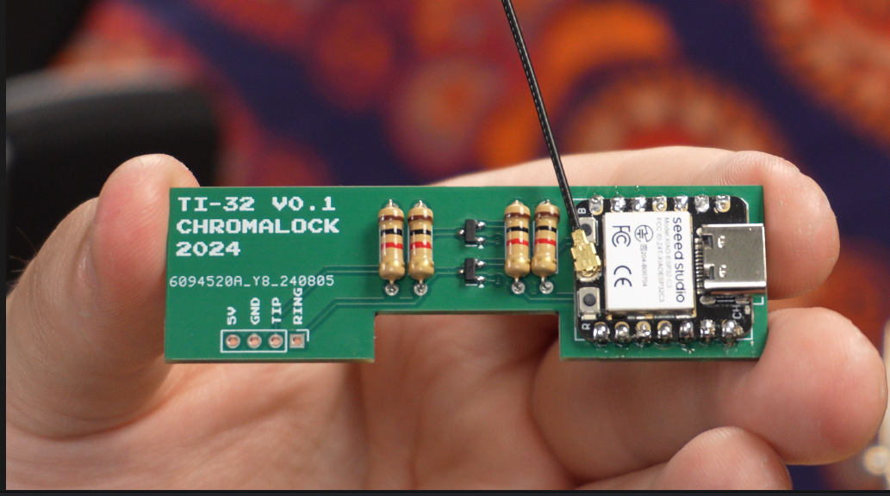

# TI-32

A mod for the TI-84 Plus Silver Edition & TI-84 Plus C Silver Edition calculators to give them internet access and add other features, like test mode breakout and camera support

## Features to be Added

- Change Wi-Fi settings directly from calculator
- Watchdog when receiving items
- Support for color images
- Action text during waiting phase
- Support for multi-page response from GPT
- Support for chat history from GPT
- Support for bigger menu (320x240 resolution only)
- Support for lowercase text
- Documentation
- Basic Web Browsing
- HTTPS Encryption
- Email Send and Read
- Discord Access
- Get local weather
- Control computer wirelessly
- QR Code & Barcode scanner
- Video player

## Bug Fixes

- Images don't work
- GPT Menu closes immediately when receiving response
- App transfer fails

## Video

